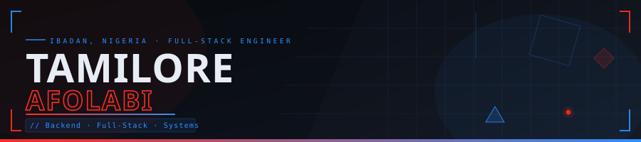
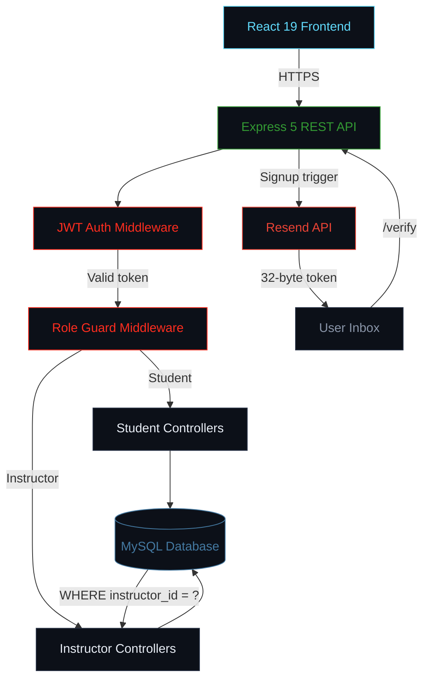

<div align="center">



<br/>

[](https://www.linkedin.com/in/tamilore-afolabi)
[](mailto:tamziyafolabi@gmail.com)
[](https://tamziy.vercel.app)


</div>

---

## `whoAmI`

```json
{
  "name": "Tamilore Afolabi",
  "alias": "Tamziy",
  "role": "Full-Stack Software Engineer",
  "location": "Ibadan, Nigeria",
  "focus": [
    "Backend systems that scale",
    "Auth flows that can't be bypassed",
    "Transactions that stay consistent under concurrency",
    "APIs built for the long run"
  ],
  "stack": {
    "backend": ["Java", "Spring Boot", "Node.js", "Express"],
    "frontend": ["React", "Vite", "HTML", "CSS"],
    "databases": ["MySQL", "PostgreSQL", "MongoDB"],
    "security": ["JWT", "bcrypt", "RBAC", "Spring Security"]
  },
  "currently": "Mastering Spring Boot — layered architecture, JPA/Hibernate, Spring Security",
  "philosophy": "I don't just ship features. I engineer the layer underneath them."
}
```

---

## `[ TECH_STACK ]`

**Languages & Core**


**Frameworks & Runtimes**


**Databases**


**Security & Auth**


**Tools**


**In Progress**


---

## `[ ACTIVE_PROCESSES ]`

- **Spring Boot:** Mastering layered architecture — service/repository separation, JPA entity relationships, Spring Security. Migrating from Node.js-first thinking to proper enterprise patterns
- **DSA:** Daily problem-solving focused on pattern recognition, time complexity, and solutions that hold up under scale — arrays, linked lists, recursion, DP
- **Systems thinking:** Concurrency control, data integrity under load, and access control architecture

---

## `[ FLAGSHIP_SYSTEM ]` — Learnova

> Production-grade e-learning platform with dual user roles, end-to-end JWT auth, email verification, and a custom dark-mode design system. Built across four deliberate phases.

**System Architecture**



**Engineering Breakdown**

| Layer | What was built | Why it matters |
|---|---|---|
| **Auth** | JWT stateless sessions + bcrypt (cost 10). Signup triggers branded email with 32-byte cryptographic token | Accounts locked at API level until confirmed — not just a UI gate |
| **RBAC** | Three independent layers: React route guard → Express middleware → SQL ownership check | No client-side bypass can reach data — unauthorised access is structurally impossible |
| **Session** | AuthContext handles token expiry and invalid tokens as separate cases | No broken states served — redirect fires before stale data renders |
| **Content** | YouTube URL parser handles watch / youtu.be / embed / Shorts | Search + filter state in URL params — every filtered view is directly linkable |
| **Prod** | Error boundaries, skeletons, typed token error responses, CORS locked to origin | ~30 files, 1,200+ line CSS design system, responsive to 320px |

### `>> Exception Handling & Edge Cases`
* **Stale State Rejection:** If a user’s JWT expires while they are filling out a form, the API rejects the submission and the React `AuthContext` catches the 401, clears local storage, and preserves the user's input state while forcing a re-auth.
* **Concurrent Video Tracking:** Handles edge cases where a user opens the same course in two tabs; progress tracking enforces a "latest timestamp wins" rule to prevent database deadlocks.

### `>> Performance Benchmarks (Local)`
* **Auth Overhead:** Custom JWT middleware adds `<15ms` latency to protected routes.
* **Query Optimization:** Indexed `instructor_id` foreign keys dropped course-fetching queries from `O(n)` table scans to `O(log n)`, averaging `120ms` response times in local testing.

> *[Insert screenshot of Postman test suite passing or API logs blocking an unauthorized request here]*

<br/>


[](https://github.com/Tamziycode/learnova)
[](https://learnova-omega.vercel.app)

---

## `[ ANCILLARY_SYSTEMS ]`

<table border="0">
<tr>
<td width="50%" valign="top">

### // GigConnect
**Escrow-Backed Service Marketplace** &nbsp;·&nbsp; *Hackathon*

Financial trust engineered into the architecture — not bolted on.

- **Interswitch API escrow** — funds held until both parties confirm completion, no mediator needed
- Webhook handler + idempotency key validation — prevents double-charging on retries
- Community price index aggregates rates platform-wide — anti-exploitation against gouging
- Geolocation routing to nearest available professional
- Strict MVC — auth, job lifecycle, chat in independent testable modules

<br/>


[](https://github.com/Tamziycode/gigconnect)

</td>
<td width="50%" valign="top">

### // Library Management API
**Enterprise REST API &nbsp;·&nbsp; Concurrency Focus**

Built for correctness under pressure. Architecture prioritises data integrity over convenience.

- **Pessimistic locking** on borrow transactions — concurrent requests for the last copy cannot both succeed
- **Transactional Rollback:** If an inventory decrement succeeds but the borrow record insert fails, the entire SQL transaction rolls back to prevent phantom missing books
- **JWT RBAC** — admin (inventory write) vs patron (borrow/view), enforced at middleware layer
- **Performance:** Paginated and indexed search endpoints maintain `<80ms` response times even when simulating 10,000+ mock book records

<br/>


[](https://github.com/Tamziycode/Library_API)

</td>
</tr>
<tr>
<td width="50%" valign="top">

### // Computerized Exam System
**Browser-Level Security**

Anti-cheat logic in a middleware layer — no UI action trusted at face value.

- Visibility API + fullscreen lock + input interception — tab switches caught before reaching the DOM
- Session state serialised on each answer — recovers in under 1s after interruption, no answer loss
- Violations logged with timestamp and event type — tamper evidence, not just prevention
- MongoDB for flexible session document storage — exam snapshots without rigid schema constraints

<br/>


[](https://github.com/Tamziycode/exam-system)

</td>
<td width="50%" valign="top">

### // DSA & Algorithms
**Daily Practice**

Solving problems that hold up under scale — not just ones that pass test cases.

- Arrays, linked lists, stacks, queues — core patterns and implementation
- Recursion and DP — memoisation, tabulation, state transitions
- Binary search, two pointers, sliding window as standard toolkit
- Time and space complexity analysis on every solution

<br/>


[](https://leetcode.com/u/Tamziycode/)

</td>
</tr>
</table>

---

## `[ TELEMETRY ]`

<div align="center">


&nbsp;


<br/>
<br/>


</div>

---

## `[ EDUCATION ]`

| | Institution | Degree | Status |
|---|---|---|---|
| `*` | University of Ibadan | B.Sc. Computer Science | Penultimate Year |

---

## `[ INITIATE_HANDSHAKE ]`

<div align="center">

[](https://www.linkedin.com/in/tamilore-afolabi)
[](mailto:tamziyafolabi@gmail.com)
[](https://tamziy.vercel.app)

*Open to backend and full-stack roles where real engineering problems exist.*

<br/>
<br/>


</div>
